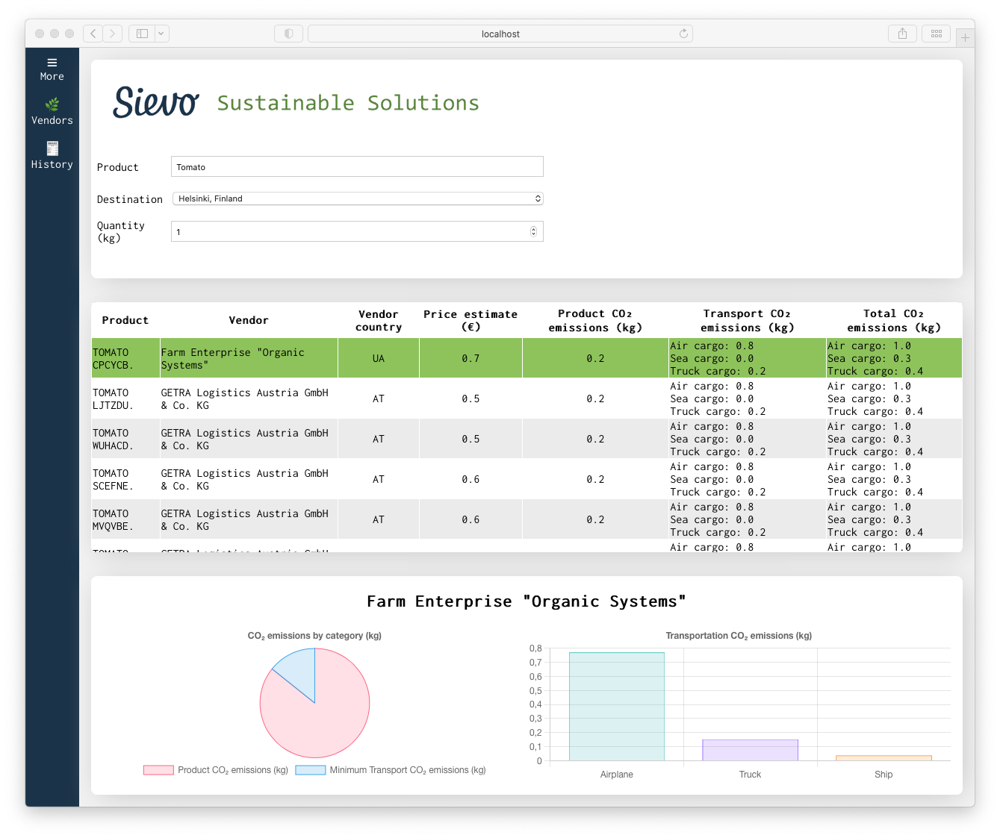

# Junction Hackathon 2021

Which vendor should a customer choose when buying a certain product, in order to get it as cheap as possible? This process of buying stuff for business purposes is called procurement and [Sievo](https://sievo.com/) is specialized in procurement analytics software. However, nowadays CO2 emissions have been an increasing concern and business level actions have a huge impact on the emissions: approximately 80% of all CO2 emissions can be linked to the procurement supply chain [[1]](https://blog.sievo.com/sievo-launches-solution-to-track-carbon-footprint-across-the-supply-chain). In this challenge, we explored ways to improve Sievo's procurement software so that it takes into account the pricing, but also the CO2 emissions that are caused by the manufacturing process of the product as well as by the transportation.

We built a working prototype application with a graphical user interface (GUI), that solves a real business need. The prototype allows Sievo's customers to browse their possible procurement options. Our solution combines internal vendor and product data with external emission data. The most challenging part of this project was that the external data is hard to match with the internal data since they use different labels for the same product category. First, we attempted to process the data automatically. However, we noticed that this was a bit too time-consuming for a hackathon, so we decided to combine a small dataset by hand and work with that since, after all, our goal was to visualize our idea with a GUI.

Even though we ended up combining some sample data by hand, we came up with some ideas on how to actually preprocess the data in an automatic manner. Here's a couple of examples:

1. Natural language processing to recognize product categories,
2. K-means clustering algorithm to cluster similar categories.

The first step in the project for us was to inspect the internal dataset and figure out what was in it. We noticed that there were actual procurements from Sievo's customers. We decided to extract the mean prices for each vendor's product using Python (since the dataset was so large). Then, we constructed a hand-made sample dataset by using these mean prices and combining CO2 emission data related to the products from external datasets. Additionally, we collected distances from multiple vendor cities to Helsinki, Finland in order to calculate the approximate CO2 emissions for transportation of the goods. All other city distances would be available by using, for example, Distance Matrix API. However, these APIs were not used in this prototype because of pricing concerns. Our hand-made sample dataset was first processed with Microsoft Excel after which we used Python to export it as a Javascript Object-Notation (JSON) file since it is then easy to work with JavaScript.

After making the sample dataset we started building the prototype GUI. We used React.js to implement all the GUI and visual data presentations. We made an automatic ranking system that ranks and recommends the most sustainable suppliers based on the CO2 emission, but also pricing. The most sustainable procurement option is always highlighted in green. Our GUI also produces a visualization of the chosen procurement option. It shows the CO2 emission contributions caused by production and transportation. Also, it separates the transportation type-specific CO2 emissions (air, sea and truck cargo) in a bar chart. We found approximate emissions for each transportation type [here](https://timeforchange.org/co2-emissions-for-shipping-of-goods/).

Even though we managed to implement a prototype project, some further improvement ideas already came into our mind:

- Automatic data preprocessing using AI & Machine Learning,
- Automatic transport specific distance calculations between vendor and buyer,
- An algorithm that suggests the shortest route which implies lower CO2 emissions.

## Instructions on how to run the project locally

1. clone the repository to your device
2. cd into the project directory _/junction2021/app_
3. install the needed dependencies with the command `npm install`
4. start the development server with the command `npm start`
